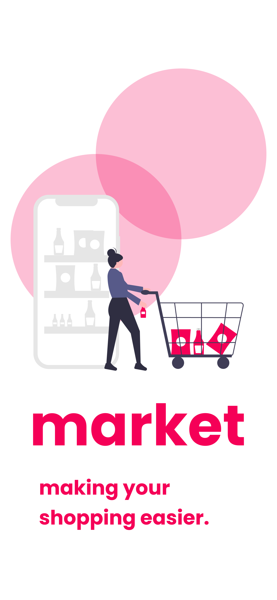
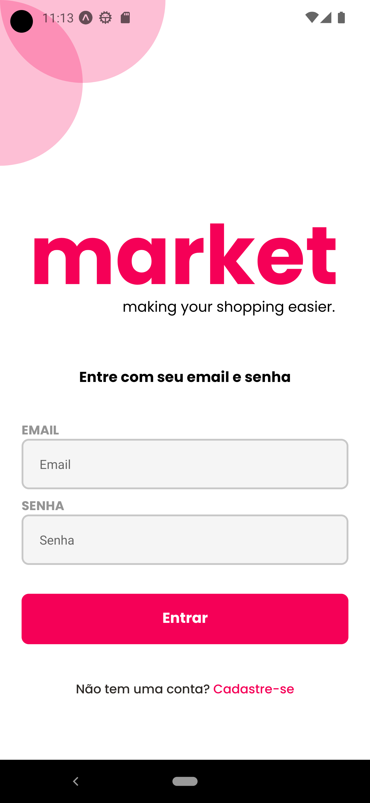
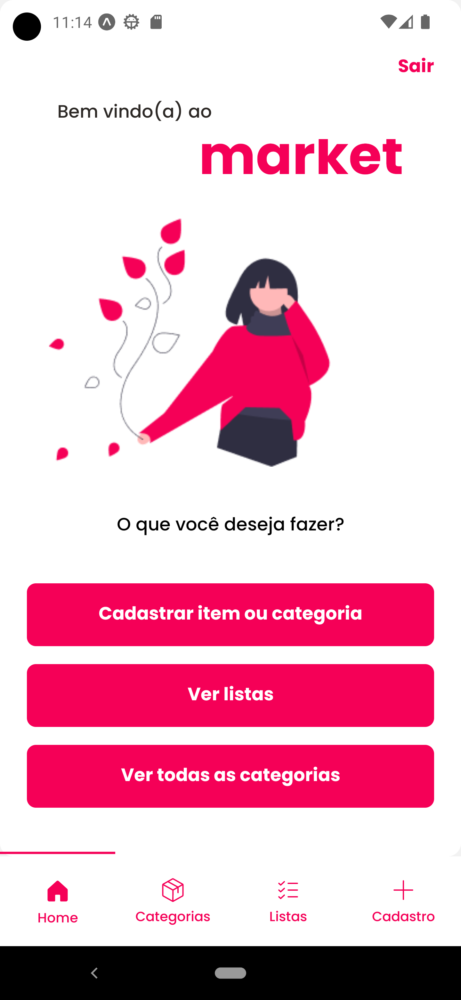
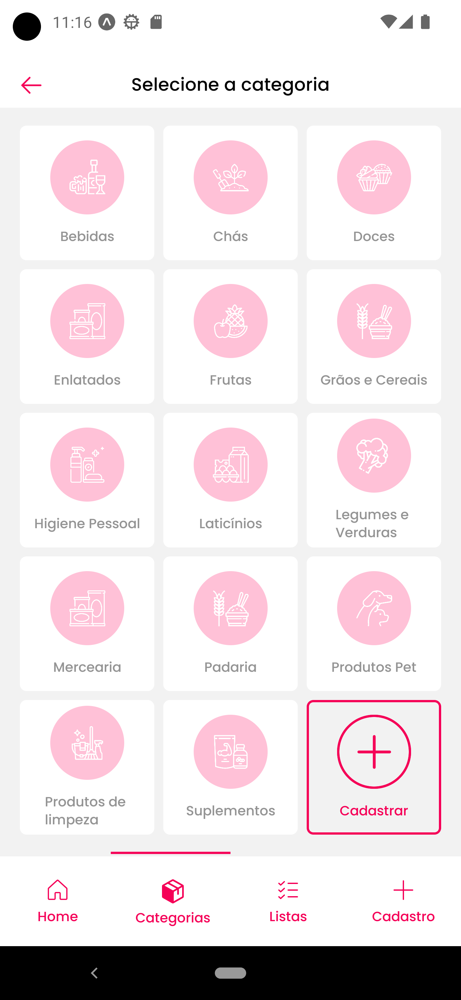
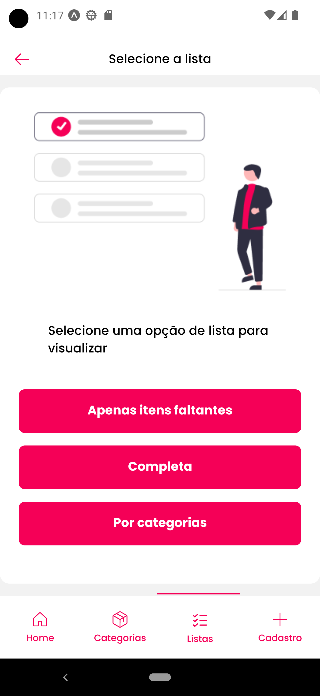
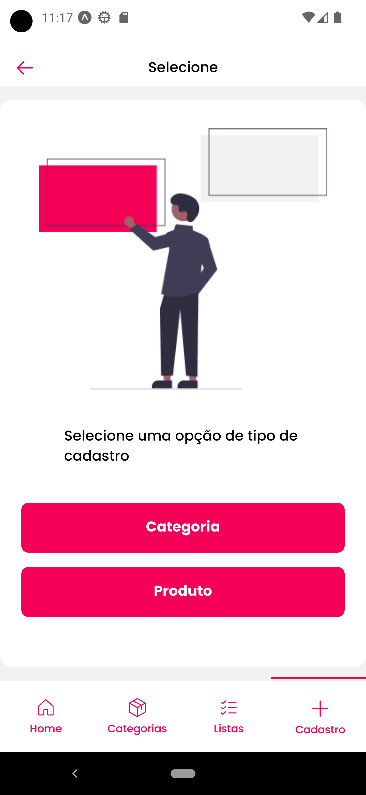

<div align="center" id="top">

</div>

<h1 align="center">Market</h1>

<p align="center">
  
</p>

<hr>

<p align="center">
  <a href="#about">Sobre o Projeto</a> &#xa0; | &#xa0;
  <a href="#sparkles-features">Features</a> &#xa0; | &#xa0;
  <a href="#rocket">Tecnologias</a> &#xa0; | &#xa0;
  <a href="#white_check_mark">Requerimentos</a> &#xa0; | &#xa0;
  <a href="#checkered_flag">Iniciando</a> &#xa0; | &#xa0;
</p>

<br>

## Sobre o Projeto

A ideia inicial do Market é ser uma aplicação onde pessoas poderão cadastrar e gerir suas listas de compras e fazer com que essa lista seja compartilhada com outra pessoa usuária.

Por exemplo: Um casal que faz compras no mercado separadamente, as vezes acabam comprando o mesmo produto ou então deixam de comprar determinado produto por pensarem que seu parceiro acabou comprando. Com o Market, isso não seria um problema, pois com uma lista compartilhada, ao marcar que um item foi comprado ou adicionar algum item na lista, ambas as pessoas saberão pois compartilham da mesma lista.

O aplicativo tem uma ideia simples e o intuito de resolver esse pequeno problema que faz parte do meu dia-a-dia, unindo então a competência de resolução de problemas reais com estudos e prática de código, design e experiência da pessoa usuária.

## :sparkles: Features

- [x] Cadastro de usuário com validação de email
- [ ] Cadastro de usuário com conta Google
- [x] Login de usuário via email
- [ ] Login de usuário via conta Google
- [ ] Sistema de recuperação de senha
- [ ] Editar dados da pessoa usuária
- [x] Listar categorias
- [x] Listar produtos em diferentes visualizações (lista completa, lista por categorias e lista de apenas itens faltantes)
- [x] Cadastro de Categoria
- [x] Cadastro de Produto
- [ ] Editar categoria já cadastrada
- [ ] Editar produto já cadastrado
- [ ] Deletar categoria já cadastrado
- [ ] Deletar produto já cadastrado
- [ ] Implementação de código único de usuário para gerar opções de pessoas para compartilhar sua lista
- [ ] Implementação de listas temporárias para serem compartilhadas com diversos usuários com finalidade de organização de eventos
- [ ] more...

## :sparkles: Melhorias a serem desenvolvidas

- [ ] Animação de loading para melhoria da experiência da pessoa usuária
- [ ] Otimização de backend para acelerar requisições ao backend
- [ ] Armazenamento local em cache para melhoria da experiência da pessoa usuária
- [ ] Uso de bottom bar com stack navigation para melhor experiência nas trocas de tela
- [ ] more...

## :rocket: Tecnologias

Foram utilizadas as seguintes tecnologias no projeto:

- [React Native](https://reactnative.dev/)
- [Expo](https://docs.expo.dev/)
- [TypeScript](https://www.typescriptlang.org/)
- [React-Query](https://tanstack.com/query/latest/)
- [Tailwind CSS](https://tailwindcss.com/)

## :white_check_mark: Requerimentos

Antes de iniciar :checkered_flag:, você precisa ter instalado:

- [Git](https://git-scm.com)
- [Node](https://nodejs.org/en/)
- [Expo](https://docs.expo.dev/)

### Configure as variáveis de ambiente .env

Para iniciar a aplicação corretamente, você deverá configurar as variáveis de ambiente corretamente. Para isso, você pode seguir os seguintes passos:

- Criar uma conta no [Supabase](https://supabase.com/)
- Dentro do Supabase, crie um novo projeto
- Dentro do Supabase, acesse as configurações da API do projeto e utilize as API keys como as variáveis de ambiente

- Após configuradas as variáveis do supabase, será necessário clonar o repositório do backend do Market

```bash
# Clone o repositório
$ git clone git@github.com:eduardomuchak/market-backend.git

# Acesse o diretório raiz do projeto
$ cd market-backend

# Instale as dependências
$ npm install

# Rode o projeto
$ npm run dev

```

## :checkered_flag: Iniciando a aplicação Mobile

```bash
# Clone o repositório
$ git clone git@github.com:eduardomuchak/market-app.git

# Acesse o diretório raiz do projeto
$ cd market-app

# Instale as dependências
$ npm install

# Rode o projeto
$ npx expo start

```

## Telas

<div align="center" id="mobile">
  
  
  

  

  

  

&#xa0;

</div>

## Figma

Link para [primeiro protótipo](https://www.figma.com/proto/7OYhEhEdtZwgkJRzJK8BPJ/Market-App?node-id=1%3A4&starting-point-node-id=1%3A4) do app:

&#xa0;

<a href="#top">Back to top</a>
